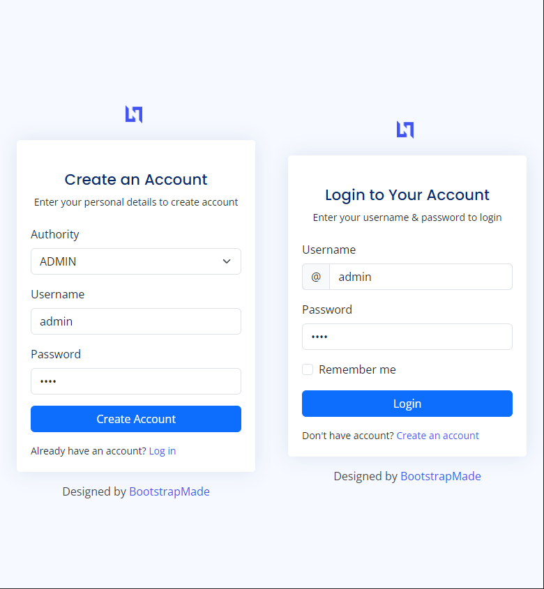
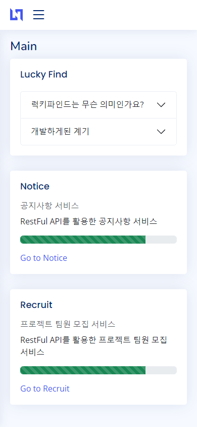

# LuckyFind [ 개발자 사이드 프로젝트 모집 서비스 ]
**코틀린을 기반으로 한 사이드 프로젝트 모집 서비스** 
 
개인프로젝트 | 진행중
 

## 시작하게된 계기
> 평소에 직장에 다니면서 제일 힘들었던 점은 프로젝트를 함께 진행할 팀원을 구하는 것입니다.  
> 일과 병행하다보면 서로 시간을 맞추기 어렵고, 적당한 프로젝트를 찾기 어렵기 마련입니다.  
> 그렇다면 개발에 진심인 사람들을 한곳에 모아 서로 소통하고 도움이 될 수 있는 서비스가 있다면 얼마나 재밌을지 생각해보았습니다.  
> 생각만해도 신나더군요 ^^  
> LuckyFind 라는 이름으로 개발을 진행하고있습니다.
 

## 개발환경 및 Skill
- Kotlin | JAVA 17
- Spring Boot 3.1.5
- Spring MVC 
- JPA 
- Spring Security 
- Thymeleaf
- H2database 
- BootStrap 
- WebSocket 
- Git

---

### 로그인 및 회원가입 

- 회원가입시 권한을 선택할 수 있습니다.
- 선택한 권한으로 회원가입후, 로그인할 시 권한에 따라 사용할 수 있는 서비스만 사용가능합니다.
- 현재 권한은 ROLE_ADMIN (관리자) / ROLE_USER (사용자) 가 존재합니다.

### 메인페이지

- 메인페이지로 접근시, LuckyFind의 소개와 각 서비스들과 서비스개발 진행정도를 확인 할 수 있습니다.
- 서비스별 링크 클릭시, 해당 서비스를 사용할 수 있는 페이지로 이동합니다.

